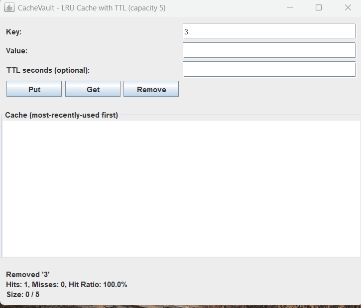

# CacheVault

An in-memory LRU (Least Recently Used) caching service built in Java, with TTL-based auto-expiry, thread-safe hit/miss statistics tracking, and both a CLI and a Swing GUI for live interaction.



## What It Does

CacheVault stores key-value data in memory for fast retrieval, and automatically manages what gets removed and when:

- **LRU Eviction** — when the cache reaches capacity, the least recently used entry is automatically evicted to make room for new data.
- **TTL (Time-To-Live) Expiry** — entries can be given an optional expiry time (in seconds), after which they're automatically removed, even if never explicitly accessed again.
- **Hit/Miss Statistics** — tracks how often a lookup successfully found data ("hit") versus came back empty ("miss"), and computes a live hit ratio.
- **Two interfaces** — a command-line REPL and a Swing GUI, both backed by the same underlying cache engine.

This mirrors the core mechanism behind real-world caching systems like Redis and Memcached, built from scratch to demonstrate the underlying data structures and design trade-offs.

## Core Design

**O(1) get/put** is achieved by combining two data structures:
- A **HashMap** for instant key lookup.
- A **Doubly Linked List** to track recency order, with sentinel head/tail nodes to simplify edge cases.

Because the HashMap gives a direct pointer to a node in the linked list, moving that node to the front (on access) or removing it from the back (on eviction) requires only pointer rewiring — no scanning — keeping both operations constant time regardless of cache size.

**TTL expiry** uses a hybrid strategy:
- **Lazy expiry** — checked on every `get()` call, so a stale read is never returned even if the background sweep hasn't run yet.
- **Active expiry** — a background thread (via `ScheduledExecutorService`) periodically sweeps and removes expired entries that were never accessed again, preventing memory from being held by dead entries indefinitely.

**Thread safety** is handled via `synchronized` methods on the core cache and `AtomicLong` counters for stats, since the GUI/CLI thread and the background TTL sweeper thread both access shared state concurrently.

## Project Structure

```
src/
├── core/
│   ├── Node.java              — doubly linked list node
│   └── LRUCache.java          — HashMap + DLL cache engine, O(1) get/put/evict
├── expiry/
│   ├── CacheEntry.java        — wraps a value with an expiry timestamp
│   └── ExpiringLRUCache.java  — adds TTL on top of LRUCache
├── stats/
│   └── CacheStats.java        — hit/miss counters and hit ratio
├── ui/
│   ├── CacheVaultCLI.java     — terminal-based interface
│   └── CacheVaultGUI.java     — Swing-based interface
├── Main.java                  — launches the CLI
└── MainGUI.java                — launches the GUI
```

## How to Run

**Compile:**
```bash
mkdir build
javac -d build src/*.java src/core/*.java src/expiry/*.java src/stats/*.java src/ui/*.java
```

**Run the GUI:**
```bash
java -cp build MainGUI
```

**Run the CLI:**
```bash
java -cp build Main
```

CLI commands: `put <key> <value> [ttlSeconds]`, `get <key>`, `remove <key>`, `print`, `stats`, `help`, `exit`.

## Example

```
put 1 A
put 2 B
put 3 C
put 4 D
put 5 E
get 1          → cache is now full; key 1 marked as recently used
put 6 F        → evicts key 2 (the true least-recently-used), not key 1
```

## Tech Stack

Java · Swing · `java.util.concurrent` (`ScheduledExecutorService`, `AtomicLong`)
